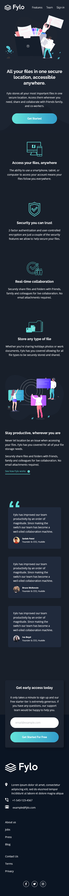
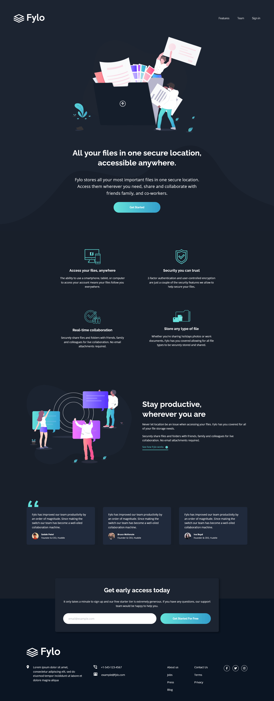

# Frontend Mentor - Fylo dark theme landing page solution

This is a solution to the [Fylo dark theme landing page challenge on Frontend Mentor](https://www.frontendmentor.io/challenges/fylo-dark-theme-landing-page-5ca5f2d21e82137ec91a50fd). Frontend Mentor challenges help you improve your coding skills by building realistic projects.

## Table of contents 📑

- [Overview](#overview)
  - [The challenge](#the-challenge)
  - [Screenshot](#screenshot)
  - [Links](#links)
- [My process](#my-process)
  - [Built with](#built-with)
  - [What I learned](#what-i-learned)
  - [Continued development](#continued-development)
  - [Useful resources](#useful-resources)
- [Author](#author)

## Overview

### The challenge 👍

Users should be able to:

- View the optimal layout for the site depending on their device's screen size
- See hover states for all interactive elements on the page

### Screenshot 📷

Mobile Design



Desktop Design



### Links 🔗

[](https://app.netlify.com/sites/dylangangat-fylo-dark-landing-page/deploys)

- Live Site URL: [Fylo landing page](https://dylangangat-fylo-dark-landing-page.netlify.app/)

## My process

### Built with 🏗️

- Semantic HTML5 markup 
- CSS custom properties
- Scss
- Flexbox
- CSS Grid
- Mobile-first workflow

### What I learned 🧠

There were many small challenges that I faced along the way but I learnt that Stackover Flow and MDN was my friends. I feel the best way to explain what I learnt is through a list. These are the things I feel I learnt along the way or improved on:

- I Learned to use fewer media queries in the responsive design. It makes the website seem more cleaner when there are less breakpoints in my opinion.

```css
@media (min-width: 45em) {
}
@media (min-width: 62.5em) {
}
```

- Learned how to set up my workflow with sass and sass partials so that I have better structure in my files.

```sh
npm init -y
npm install sass --save-dev
sass --watch scss:css
```

- I implemented the DRY principle so I reused a lot of the classes globally. For example I created a flow-content class so I can keep spacing consistent between all content.

```css
.flow-content > * + * {
  margin-top: var(--flow-spacer, 1.2em);
}
```

- Learned how to use pseudo elements and the importance of their containing block.

- Also learnt new pseudo classes :invalid/:valid and how to use them in an input.

```css
input:not(:focus):not(:placeholder-shown):invalid + .error {
  display: inline-block;
}
```

- I found while I was working that using GRID was more beneficial for layout and FLEX was more for content. I feel like I would use this system a lot more often now.

- The most challenging part was coming up with the best responsive design approach to structure my html so that I can use as little code as possible when styling the layout.

- One other challenge I faced was figuring out how to make a svg change color on a hover state. It was quite tricky for me but I ended up embedding the svg markup into my html instead of linking it to the image source. That way I could manipulate the fill through css. It's not the cleanest looking way but that was the best I could come up with.

### Favorite selector from this project 🥇

Used this for most of spacing and I feel it made my code cleaner and life so much easier.

```css
.flow-content > * + * {
  margin-top: var(--flow-spacer, 1.2em);
}
```

### Continued development 📈

- I feel for the future I need to improve my understanding with svg's and how to use them in projects.
- Also I want to design websites in a shorter amount of time.

### Useful resources 🔖

[bram.us](https://www.bram.us/2021/01/28/form-validation-you-want-notfocusinvalid-not-invalid/) - This helped me to use plain css and no javascript to create input error message. I would use this approach again if I am restricted to only using html and css in a project.

[mdn](https://developer.mozilla.org/en-US/) - I used mdn when either searching for what's the best semantic approach for laying out content or just to understand things more indepth, like how containing block and stacking context affects your website. This will always come in handy with every project I do because I would always need to reference back.

[stackoverflow](https://stackoverflow.com/) - When I ran into a few bugs along the way this would be my go to website. This is a great place to get ideas or answers to solutions that you're looking for. This Is also one of those websites every web developer should bookmark.

## Author

Frontend Mentor - [@DylanGangat](https://www.frontendmentor.io/profile/DylanGangat) 😊
